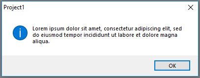
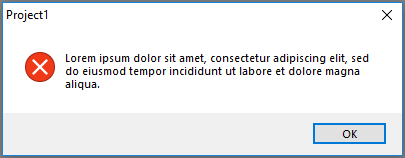
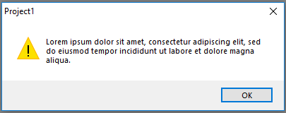
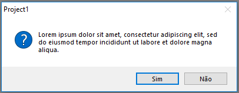
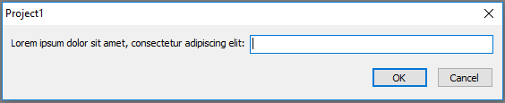

# Dialog Boxes for Delphi Projects


This component is a dialog factory for Delphi projects (VCL and uniGUI). It uses native resources to create dialogues. Uses native build directives to identify the project type (VCL / uniGUI).

Why use? Allows use the same code for desktop application (VCL) and web applications (uniGUI).

## Prerequisites
 * [**Boss**](https://github.com/HashLoad/boss) - Dependency Manager for Delphi
 * **VCL Projects**
   * [**BlockUI-VCL**](https://github.com/viniciussanchez/blockui-vcl) - Block User Interface for VCL Projects (Delphi)
 * **uniGUI Projects**
   * [**uniGUI**](http://www.unigui.com/) - Web Application Framework for Embarcadero Delphi
 
### Installation 
```
boss install github.com/viniciussanchez/dialogs4delphi
```

### Getting Started
You need to use Dialogs4D.Factory
```
uses Dialogs4D.Factory;
```

#### Success dialog box
```
begin
  TDialogs.Info('Information');
end;
``` 


#### Error dialog box
```
begin
  TDialogs.Error('Error');
end;
``` 


#### Warning dialog box
```
begin
  TDialogs.Warning('Warning');
end;
``` 


#### Confirm dialog box
```
begin
  if TDialogs.Confirm('Warning') then
    Continue;
end;
``` 


#### Input dialog box
```
var
  Name: string;
begin
  Name := TDialogs.Input('Your name:', 'Default value');
end;
``` 

